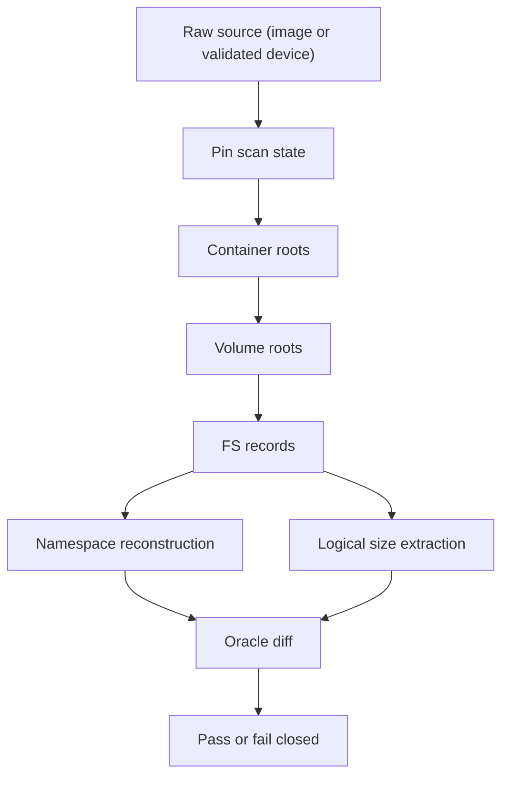

# Narrow V1 Parser Contract

Status: Draft
Date: 2026-04-24
Scope: Implementation-facing contract for the first raw parser prototype
Related docs:
- `spec.md`
- `docs/research/sources/SR-001-v1-support-boundary.md`
- `docs/research/sources/SR-002-checkpoint-omap-root-contract.md`
- `docs/research/experiments/EX-01-live-checkpoint-consistency/README.md`
- `docs/research/experiments/EX-02-required-record-taxonomy/README.md`

## Bottom line

The first raw parser prototype should do one thing only:

- parse one APFS volume
- at one chosen coherent filesystem state
- reconstruct correct namespace
- report `logical size`
- fail closed outside the tested raw-mode allowlist

It should not attempt live drifting-state reads, incremental reuse, physical or
shared accounting, or merged boot-root semantics.

## Contract Overview

## 1. Supported Mode

This contract applies to one mode only:

- raw single-volume namespace plus `logical size`

The intended raw-mode environments are:

- offline images
- explicitly stable APFS views
- tightly controlled lab volumes

This contract does not apply to:

- general live startup-disk raw parsing
- merged system/data/firmlink/cryptex namespace synthesis
- incremental reuse
- allocated, exclusive, shared, or snapshot-retained accounting

## 2. Scan State Contract

### 2.1 State selection

The parser must operate on one chosen filesystem state for the full run.

The contract is:

1. read block 0 only as the locator for checkpoint metadata
2. locate the checkpoint descriptor area
3. scan descriptor entries for candidate `nx_superblock_t` objects
4. choose the valid checkpoint superblock with the highest `xid`
5. record that `scan_xid`
6. resolve all virtual objects relative to that chosen state

The parser must never intentionally mix objects from different transaction
contexts.

### 2.2 Live-state boundary

`EX-01` already showed that the latest visible checkpoint changes under write
churn on a mounted APFS lab image.

Therefore:

- "always read latest while the volume keeps changing" is not a valid v1 model
- if a raw source cannot be pinned to one coherent state, raw mode must fall
  back

## 3. Root Discovery Contract

For narrow v1, the required chain is:

1. chosen checkpoint superblock
2. container OMAP
3. selected volume superblock
4. selected volume OMAP
5. file-system root tree

Required first-class roots:

- latest valid checkpoint
- container OMAP
- selected volume superblock
- selected volume OMAP
- file-system root tree

Not required for the first cut:

- extent-reference tree
- snapshot metadata tree
- firmlink or volume-group synthesis
- broader sealed-volume support trees unless the chosen target environment
  explicitly requires them

## 4. Resolver Contract

The resolver input is not bare `oid`.

Minimum resolver input:

- `omap_context`
- `oid`
- `scan_state`

Where:

- `omap_context` means the owning container or volume OMAP domain
- `scan_state` means the chosen state anchor for the run, normally `scan_xid`

Minimum resolver behavior:

1. choose the correct owning OMAP
2. look up the highest usable mapping for `oid` within the chosen scan state
3. read the referenced object
4. validate the object before use

Minimum validation checks:

- object checksum is valid
- object header `o_oid` matches expected logical identity where applicable
- object header `o_xid` is not newer than the chosen scan state
- object type and subtype match the caller's expectation
- object layout is recognized for the current support matrix

If any of those checks fail, the parser must fail closed for raw mode.

## 5. Required Trees And Records

### 5.1 Trees

For narrow v1, traverse only the trees needed for:

- namespace reconstruction
- `logical size`

Current best required-tree set:

- file-system root tree

Current best deferred-tree set:

- extent-reference tree
- snapshot metadata tree
- boot-root presentation layers

### 5.2 Record families

Current best required-record matrix:

- Namespace core:
  - `DIR_REC`
  - `INODE`
- Logical size:
  - `INODE`
  - dstream or equivalent size-bearing inode fields
- Hard links, when present:
  - `SIBLING_LINK`
  - `SIBLING_MAP`
- Symlink fidelity:
  - `INODE`
  - symlink-bearing xattr or equivalent metadata, validated in `EX-03` through
    `XATTR_SYMLINK_EA_NAME` in the tested image-backed environment

Current best deferred record families:

- extent-reference and broader physical/shared-accounting records
- boot-root presentation records

## 6. Namespace Contract

### 6.1 Path graph

Namespace reconstruction is defined as:

- directory membership comes from directory records
- file identity comes from inode-backed object identity
- rename and move may change path placement without changing file identity

The parser must preserve:

- full relative path
- entry type
- stable file identity for the chosen state

### 6.2 Case behavior

Case behavior is volume-mode-dependent.

The parser must:

- preserve visible names as stored for the chosen state
- respect the volume's case-sensitive or case-insensitive semantics

### 6.3 Hard links

Hard links are not a corner-case polish item.
They are part of the core namespace contract.

V1 hard-link contract:

- multiple path entries may refer to the same file identity
- the parser should surface the shared file identity explicitly
- path graph and inode graph must not be conflated

### 6.4 Symlinks

V1 symlink contract:

- surface symlink entries as symlink nodes
- do not follow symlink targets during namespace traversal
- record the target string from the symlink-bearing xattr path validated in the
  current allowlist
- if a future environment breaks that assumption, treat it as a bounded support
  gap and fail closed rather than silently mis-typing the entry

## 7. Logical Size Contract

### 7.1 Per-file metric

The canonical per-file metric is:

- `logical size`

Current extraction contract:

- use inode size or dstream size-bearing fields
- when compressed-file metadata exposes a distinct uncompressed logical size,
  prefer that logical size

### 7.2 Directory aggregate policy

V1 canonical directory aggregate policy is:

- unique-inode logical total within the aggregate root

Meaning:

- regular file logical size is counted once per aggregate root
- additional hard-link paths to the same file identity inside that aggregate
  root do not increase the aggregate

Implications:

- directory totals are intentionally protected against obvious hard-link
  overcounting
- sibling directory totals may not be strictly additive into the parent when the
  same file identity appears in more than one subtree

This is acceptable for v1 because it is explicit and less misleading than naive
path-summed totals.

### 7.3 Exclusions

This contract does not define:

- allocated size
- exclusive size
- shared size
- snapshot-retained attribution

## 8. Oracle Alignment

For this contract, the oracle is:

- mounted-view namespace for the same chosen volume and stable state
- public logical-size metadata for the same chosen entries

The proof condition is:

- raw parser output matches oracle for path, entry type, file identity, and
  `logical size` within the chosen mode

## 9. Fail-Closed Conditions

Raw mode must stop or fall back when any of the following is true:

- checkpoint selection is ambiguous or malformed
- the chosen scan state cannot be pinned
- unsupported checkpoint layout is encountered
- object checksum fails
- resolved object type or subtype is unexpected
- required OMAP context is ambiguous
- unsupported incompatible feature flags are present
- the environment requires unsupported encryption, snapshot, or boot-root
  semantics

## 10. First Prototype Boundary

The first raw parser prototype that claims to implement this contract should:

- take one raw APFS source
- choose one state
- enumerate one volume
- emit namespace entries with stable file identity
- emit `logical size`
- compare against the oracle corpus

It should not:

- reuse cache across runs
- claim physical/shared accounting
- claim merged boot-root semantics
- continue past unsupported states with best-effort guesses

## 11. Open But Bounded Gaps

Inside the current image-backed allowlist, `EX-03` closed the first
raw-vs-oracle proof gap and removed symlink target fidelity from the active
medium-confidence list.

The remaining bounded gaps are now future-triggered only:

- any raw-vs-oracle mismatch that appears when the corpus broadens
- any environment-specific record/layout variation that escapes the tested
  allowlist

Those should still be handled by targeted microprobes, not by reopening broad
research tracks.
